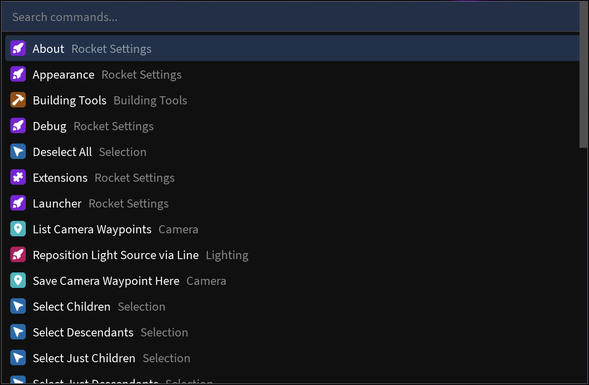

	
	<h1>Rocket</h1>

Rocket is a Roblox Studio plugin to supercharge your workflows with powerful
productivity commands, all packaged with an extendable command launcher.

## Features

-   **Powerful:** Forget installing 20 other plugins, Rocket is bundled with a
	versatile suite of core extensions
-   **Speed of Thought:** One menu to launch commands, with fuzzy searching and
	shortcuts, alongside settings to make Rocket yours
-   **Extensible:** Write and use third-party extensions with command arguments, 
	preferences, and UI via Iris
	

## Non-Goals

-   **Aesthetics:** Rocket prioritizes functionality and ease of use, aesthetics
	come later with Iris themes.
